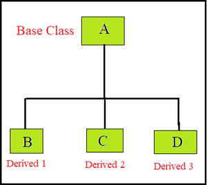
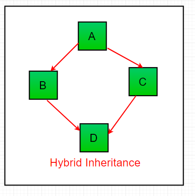

# Fundamental OOP concepts

## Encapsulation

 Encapsulation is hiding or wrapping methods and attributes together into a single unit. It is the way to ensure security. It hides the data from the access of outside. Unless we want this behavior using getters and setters

- keeps the programmer in control of access to data. Hide internal representation by using private fields
- setters are great because you can do validation
- encapsulate the code you expect or suspect to be changed in the future
- it is easier to test and maintain proper encapsulated code

## Abstraction

 Quite similarly to encapsulation, abstraction refers to only showing essential details and keeping everything else hidden

 Applying abstraction means that each object should only expose a high-level mechanism for using it

 This is very important when working on a program incrementally focusing on one class, finishing it then going to the next one

 It's best to think about your program in terms of interface and implementation

 The interface refers to the way sections of code can communicate with one another. This typically is done through methods. The implementation of methods should be hidden inside a class

 Creating an interface through which classes can interact ensures that each piece can be individually developed

## Inheritance

- is relationship

 Inheritance is the principle when one object acquires all the properties and behaviors of a parent object
 The subclass inherits properties and methods from its parent superclass. It provides code reusability.

 Types of inheritance:

- Single inheritance, subclasses inherit the feature of one superclass

- Multilevel inheritance, a derived class will be inheriting a base class and as well as the derived class act as the base class to other class

- Hierarchical inheritance, one class serves as a superclass (base class) for more than one class

- Multiple inheritance, one class can have more than one superclass and inherit features from all parent classes. We can achieve this through interfaces

- Hybrid inheritance (through interfaces)


## Polymorphism

 One task performs in different ways. It achieves by method overriding or method overloading depending on the language

 Method overriding - only unique method names are allowed
 Method overloading - multiple methods with the same name but different arguments

 Dynamic polymorphism occurs during runtime
 The methods share the same name but have a different implementation. E.g. implementation in subclasses overrides that of the superclass

 Static polymorphism occurs during compile-time
 It's when multiple methods with the same name but different arguments are defined in the same class. This is method overloading. In Dart, every method must have a unique name. There is no method overloading in dart

## Coupling

Is a degree of interdependence between software classes or methods. It arises when classes are aware of each other.

- a measure of how closely connected two classes or two methods are
- the strength of the relationship between classes
  
### Low / loose coupling

Small dependencies between classes or methods. Easier to change code without introducing bugs in other classes or methods

### Tight coupling

Two classes or methods are closely connected. A change in one module may affect another module

## Cohesion

Refers to what the class or method can do

### Low cohesion

Class does a great variety of actions. It is broad, unfocused on what it should do

### High cohesion

Class is focused on what it should be doing. It contains only methods relating to the intention of the class

## Association

Represents the relationship between the objects. Here an object can be associated with one object or many objects. Association can be unidirectional or bidirectional There can be four types of association between the objects:

- one to one
- one to many
- many to one
- many to many

## Aggregation

- independent. e.g. airplanes at an airport

Is a way to achieve Association. It represents the relationship where one object contains another object as a part of its state. It represents a weak relationship between objects

## Composition

- has relationship
- cannot exist independent of the parent. e.g. wheels on an airplane

Is also a way to achieve association. The composition represents the relationship where one object contains other objects as a part of its state. There is a strong relationship between the containing object and the dependent object.

It is the state where containing objects do not have an independent existence. If you delete the parent object all the child objects will be deleted automatically.

## Object

Any entity that has state and behavior. An Actual thing built from a class

- can be defined as an instance of a class
- contains an address and takes up some space in memory

Objects can communicate without knowing the details of each other's data or code

## Class

A class can be defined as a blueprint from which you can create an individual object. It represents a set of properties and methods that are common to all objects of one type.

- Class doesn't consume any space

### Class anatomy

- properties or attributes
- methods
- constructors

### Class vs Instance variable

#### Instance variable

It is a class variable without a static modifier and is usually shared by all class instances

- across different objects, these variables can have different values
- it is tied to a particular object instance of a class, therefore, the contents of the instance variable are independent of one object instance to others

```java
class Taxes  
{  
   int count;  
   //...  
}  
```

#### Class variable

It is a static variable that can be declared anywhere at class level with static

- across different objects, these variables can have only one value
- it is not tied to any particular object of the class, therefore, can share across all objects of the class

```java
class Taxes  
{  
  static int count;  
   //...  
}  
```

### Class vs Instance method

#### Instance method

Requires an object of its class to be created before it can be called. To invoke the instance method, we have to create an object of the class where this method is defined.

- it can access instance variables.
- it can be overridden

```java
void geek(String name)
{
 // code to be executed...
}
```

#### Class method

It can be called without creating an object of a class. It is referenced by the class name itself

- all methods declared with static
- can not be overridden
- shared among all objects created from the same class

```java
static void geek(String name)
{
 // code to be executed...
}
```
